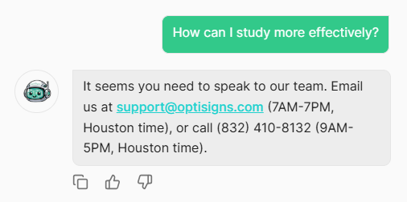
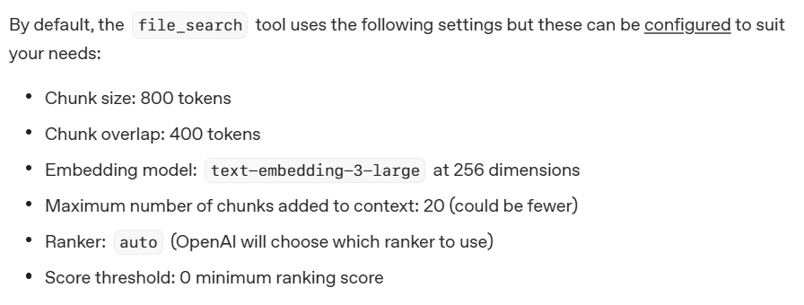

## Expected Result from Assistant

### System prompt (verbatim):

You are OptiBot, the customer-support bot for OptiSigns.com.

- Tone: helpful, factual, concise.
- Only answer using the uploaded docs.
- Max 5 bullet points; else link to the doc.
- Cite up to 3 "Article URL:" lines per reply.

=> Result constraints:

- Prevent hallucinations from the Assistant.
- If the document is too large, the AI should summarize it in five bullet points and link to the original document.
- A maximum of three URLs may be cited; the AI must choose the most relevant documents to cite.
- How should cases where the user asks something unrelated to the training data be handled?
  => Test with OptiBot:
  

## Unknown knowledges

### Vector store in OpenAI Assistant

=> This document provides an overview of how to use vector stores and attach files to them for the Assistant to query: https://platform.openai.com/docs/assistants/tools/file-search

1. A Vector Store is the storage component of the File Search feature in the OpenAI Assistant.
2. File search configuation:
   

=> Data flow from creating Vector Store and uploading files - Ask Assistant:

1. Phase 1: Ingestion
   Raw Files $\rightarrow$ Parsing (Extracting text) $\rightarrow$ **Chunking (Splitting into 800-token pieces with 400-token overlap) $\rightarrow$ Embedding (Converting text into vectors/numbers)** $\rightarrow$ Indexing (Storing vectors in the Vector Store)
2. Phase 2: Retrieval
   User Query $\rightarrow$ **Query Embedding (Converting question to a vector) $\rightarrow$ Vector Search (Finding the top 20 most similar chunks in the store)** $\rightarrow$ Ranking (Selecting the best-matching snippets) $\rightarrow$ Context Injection (Sending snippets to the AI's "brain") $\rightarrow$ Generation (AI writes the answer based only on those snippets) $\rightarrow$ Final Response

=> **RAG Framework**

### Delta Detection Algorithm

=> Idea 1: In the vector store, the vectors are created by the chunks, so we can detect the chunks that have a change in themselves and update the vectors related to it. => Problems: The vector store is black box

=> Idea 2: Test scraper first.