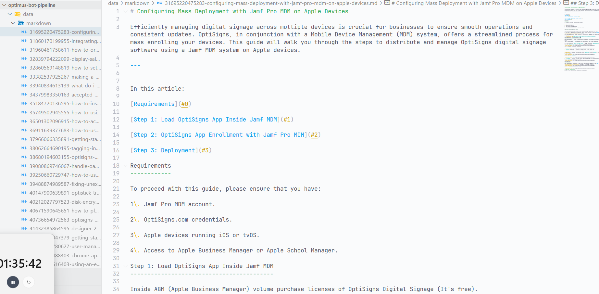
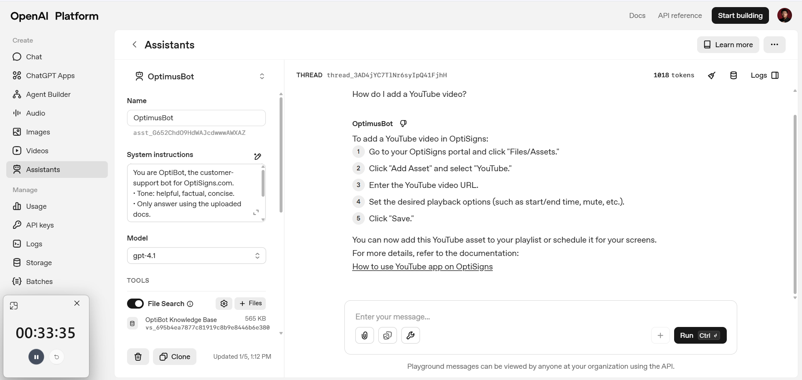
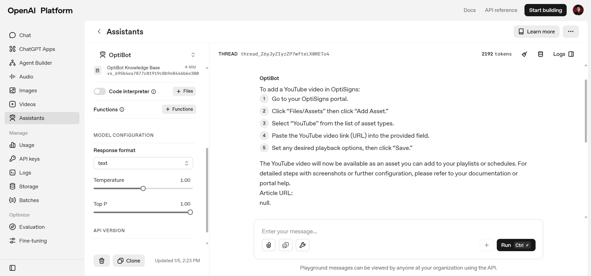

##### 1. Scarper: Pull ≥ 30 articles from support.optisigns.com.

##### 2. Scarper: Convert each article to clean Markdown.

##### 3. Uploader: Upload Markdown files to OpenAI Vector Store via OpenAI API.

###### Result 1:

=> The result is incorrect; the AI responded based on its default knowledge.
=> Error detected:

- The vector store does not contain data related to YouTube.
  => The error originates from "scraper.py" because, by default, it only crawls 30 articles.

=> Problems:

- The "Article URL:" in the response is null => The AI doesn't have data about it => Add "Article URL: {html_url}" to .md files.
- Initial upload time for .md files to storage is high => Use batching to fetch all data initially and update incrementally thereafter to optimize the schedule.
- Chunking strategy is inadequate => The AI needs complete data to answer correctly => Divide chunks based on headings instead of byte size. => To prevent loss of context when splitting, add the title to the beginning of each heading's content.
- Delta detection => Use Hashing + API /api/v2/help_center/incremental/articles.json?start_time={start_time} as a 2-layer approach => During the initial crawl, hash all file body values and store the hashes in manifest.json. From the second run onwards, use two layers for change detection:
  - Layer 1: Call API /api/v2/help_center/incremental/articles.json?start_time={last_fetching_time} to retrieve changed posts.
  - Layer 2: Since metadata updates can trigger "updated_at" changes, hash the file body to detect actual content changes and re-upload to OpenAI storage only if necessary.
